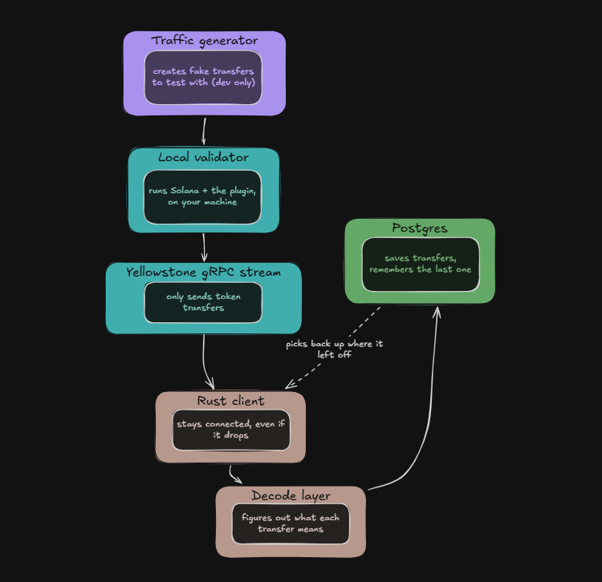

# Solana Token Transfer Indexer

**A real-time SPL Token transfer feed built on Yellowstone gRPC — the production data layer TrustTrail's wallet-history lookups actually need.**

TrustTrail currently reconstructs a wallet's on-chain history by polling Helius: asking "what's changed?" over and over, on demand, per lookup. That works for a demo. It doesn't scale, and it can't tell you about something the moment it happens — only the next time you happen to ask. This project is the alternative: a client that opens a standing connection to a Solana validator's event stream and is told the instant a token transfer happens, rather than asking.

It's deliberately small. Scope is the point, not a limitation:

- SPL Token transfers only — not swaps, not a DEX, not NFTs
- A local devnet validator with a self-generated traffic stream — not mainnet, not historical backfill
- No frontend — this is a data-layer proof, not a product

---

## The problem this solves, one level down

Solana validators know about every account change and transaction the instant they process it — it's literally what they're doing. Geyser is the hook built into validator software that exposes that internal firehose. Yellowstone is the standard way of putting that firehose on the network as a gRPC stream, so any external program can open a connection and start receiving events live, instead of asking a validator "anything new?" over and over.

That live connection is the whole value proposition — and also the whole engineering problem. Connections drop: networks hiccup, validators restart, your own process crashes. For most apps that's a shrug. For an indexer, whose entire job is *completeness*, a dropped connection means a silent, permanent gap — transfers nobody told you about and that you have no way to retroactively discover.

## Architecture



## Components

### 1. Local validator + Geyser plugin
A single-node, ephemeral, fully local Solana cluster (`agave-test-validator`) with the open-source `yellowstone-grpc-geyser` plugin compiled and loaded via `--geyser-plugin-config`. This is a private simulation — it has no connection to the real public Solana devnet, and the only activity it ever contains is what the traffic generator creates on it. "Devnet" here means "not real money," not "the shared public devnet network."

It plays the role a hosted provider like QuickNode would play in production, for free, on a laptop — worth being precise, though, about what that role actually is. Every managed Yellowstone provider is **mainnet-only**: Chainstack's docs say so outright, and every QuickNode endpoint example uses `solana-mainnet.quiknode.pro` with no devnet equivalent shown anywhere. There doesn't appear to be a commercial hosted Yellowstone offering for devnet at all — the demand driving this product (trading, MEV, real-money indexing) is a mainnet thing. TrustTrail itself is deployed on devnet, so this project is **not** a claim that it watches TrustTrail's live activity today — the accurate framing is that this is the pipeline TrustTrail's data layer would run on if that lending activity were being tracked on mainnet. The client code doesn't know or care which: it's the standard `yellowstone-grpc-client` crate speaking the standard Dragon's Mouth protocol, unchanged whether pointed at `localhost` or at QuickNode's mainnet endpoint with an `x-token` header added. Known rough edge on the local setup itself: block reconstruction has a documented bug on non-leader validators like this one (zero entry counts) — doesn't affect us, since we only care about transaction-level Token instructions, not full block metadata.

### 2. Traffic generator (`scripts/traffic-gen/`, TypeScript)
The local validator starts with an empty ledger — there's nothing to stream until something happens. This is a small, separate script that creates a test mint, funds a handful of keypairs, and loops submitting `Transfer`/`TransferChecked` instructions between them on an interval. It is explicitly a dev fixture, not part of the deliverable, and lives in its own folder so nobody mistakes it for "the indexer."

### 3. Connection module (`grpc.rs`)
Opens the gRPC channel and builds the `SubscribeRequest`: a `transactions` filter with `account_include` set to the classic Token Program ID, commitment level `Confirmed`. Returns the stream of `SubscribeUpdate` messages. This is the literal phone line everything else depends on.

### 4. Reconnection policy (client config)
`yellowstone-grpc-client` ships its own `ReconnectionPolicy` — automatic reconnect with exponential backoff, on by default, including correct handling of equivocation (a validator briefly producing two versions of the same slot before one finalizes) via blockhash comparison. We configure this rather than write a retry loop ourselves — re-deriving the equivocation handling by hand is easy to get subtly wrong, and there's no reason to when the library already does it correctly. This only covers one failure mode: a transient drop *while the process keeps running*.

### 5. Watermark / crash recovery (`db.rs`)
The reconnection policy above does nothing if the process itself dies — a crash, a redeploy, being stopped overnight — because a fresh process has no in-memory state to reconnect from. This module persists `last_committed_slot` to Postgres after every successful write, and reads it back on startup to set `from_slot` on the very first subscribe request of a new process. The library gets you through a hiccup; this is what gets you through a restart.

### 6. Decode layer (`decode.rs`)
Each raw transaction is turned into a list of `InstructionUpdate` values via `InstructionUpdate::build_from_txn` (a standalone function in `shipstern-core` — no framework `Runtime` required, confirming the hand-rolled architecture was viable). Each one is then handed to Shipstern's `InstructionParser`, and only `Transfer` / `TransferChecked` variants are kept — everything else (mints, burns, approvals) is dropped here. Conceptually the same work as manually deriving Kamino's instruction discriminators in TrustTrail, just for a program where someone has already done the byte-layout work. Both account structs carry a `multisig_signers: Vec<Pubkey>` field for SPL Token's multisig-authority feature — out of scope for this narrow build; only the single `owner` is captured as `authority_pubkey`.

### 7. Idempotent writer (`db.rs`)
`INSERT ... ON CONFLICT (slot, signature, instruction_index) DO NOTHING` into `token_transfers`, in the same transaction as the watermark update. This is what makes replay-after-reconnect safe: seeing the same transfer twice becomes a harmless no-op instead of a duplicate row or a crash.

### 8. Schema
```sql
CREATE TABLE token_transfers (
    slot                BIGINT NOT NULL,
    signature           TEXT NOT NULL,
    instruction_index   SMALLINT NOT NULL,
    source_pubkey       TEXT NOT NULL,
    destination_pubkey  TEXT NOT NULL,
    authority_pubkey    TEXT NOT NULL,
    mint                TEXT,              -- NULL for legacy Transfer, only TransferChecked carries a mint
    amount              NUMERIC NOT NULL,
    decimals            SMALLINT,          -- NULL for legacy Transfer
    received_at         TIMESTAMPTZ NOT NULL DEFAULT now(),
    PRIMARY KEY (slot, signature, instruction_index)
);

CREATE TABLE indexer_watermark (
    id                  SMALLINT PRIMARY KEY DEFAULT 1,
    last_committed_slot BIGINT NOT NULL,
    updated_at          TIMESTAMPTZ NOT NULL DEFAULT now()
);
```

## Known limitations, stated honestly

- Replay recovers from a brief disconnect, not an extended outage — Yellowstone's replay buffer covers a bounded recent window, not unlimited history.
- `mint` and `decimals` are nullable because the legacy `Transfer` instruction doesn't carry a mint account at all — that's a property of the instruction format, not a gap in the indexer.
- No block timestamps. A real `block_time` requires a second subscription (`SubscribeUpdateBlockMeta`) joined on slot — out of scope for a narrow build; `received_at` (wall-clock at insert time) is stored instead.


## Stack

Rust · `yellowstone-grpc-client` · `shipstern` (SPL Token parser, formerly yellowstone-vixen) · Postgres · `agave-test-validator` · TypeScript (traffic generator, dev-only)
